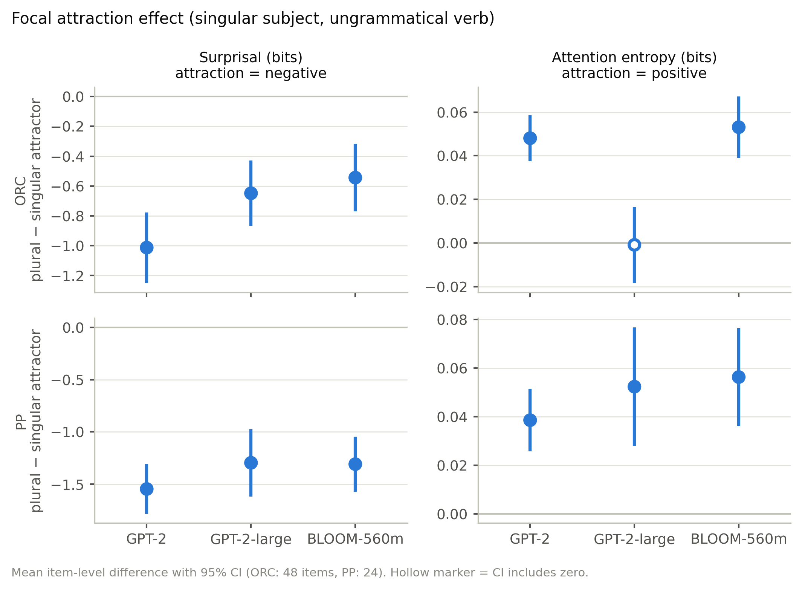
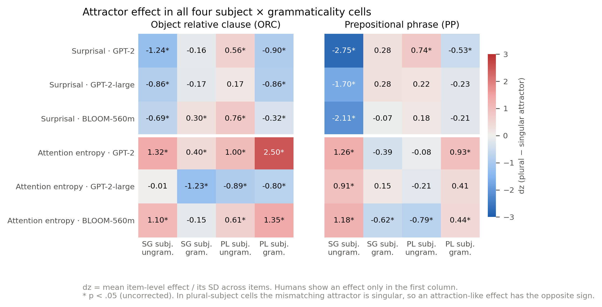

# Attention entropy vs. surprisal as signatures of agreement attraction in language models

Final project for the seminar "LLMs as models of human sentence processing" (SoSe 2026).

**Author:** Rahil Dasadia

## Research question

> Does attention entropy provide a more consistent cross-model signature of agreement attraction than surprisal, particularly in object relative clauses (ORC)?

In agreement attraction, readers process an ungrammatical verb more easily when a nearby noun matches the verb in number (*The key to the cabinets were rusty*). Wagers, Lau & Phillips (2009) found this facilitation only for singular subjects and only in ungrammatical sentences, both in prepositional-phrase (PP) and ORC constructions. In ORC the attractor (the head noun) does not stand between subject and verb, which makes the effect hard to explain by linear proximity.

Surprisal from transformer language models reproduces this effect (Ryu & Lewis, 2021), but von der Malsburg & Padó (2026) showed on the same Wagers et al. items that model predictions become inconsistent in ORC. Ryu & Lewis also proposed attention entropy at the verb as a measure of retrieval interference. We asked whether this internal measure is more stable across models than surprisal. Turk & Neu (2026), comparing four languages, found the opposite: surprisal gave the clearer and more consistent signal. Our study tests whether that also holds across models and in ORC.

**Hypothesis.** Attention entropy gives a more consistent cross-model signature of agreement attraction than surprisal, and this advantage is larger in ORC than in PP.

**Answer.** Not supported. In ORC, surprisal showed the attraction effect in all three models, attention entropy in only two. In PP, both measures showed the effect in all three models and neither was clearly more consistent.

## Materials

| File | Items | Source |
|---|---|---|
| `data/orc_stimuli.csv` | 48 × 8 = 384 | Wagers et al. (2009), Exp. 3 |
| `data/pp_stimuli.csv` | 24 × 8 = 192 | Wagers et al. (2009), Exp. 4 |

Both sets cross subject number × attractor number × grammaticality (conditions a–h). For PP, the singular-subject base items were taken from the appendix of Wagers et al.; the plural-subject conditions (e–h) were reconstructed by pluralizing the head noun (`source` column). The original experiment tested plural subjects as well, but we could not check our versions against the original items.

Each row gives the sentence prefix up to the verb (e.g. *The key to the cabinets unsurprisingly*), the verb shown (`target_verb`) and the correct and incorrect verb forms.

## Models and measures

Models: `gpt2` (12 layers, 12 heads), `gpt2-large` (36 layers, 20 heads), `bigscience/bloom-560m` (24 layers, 16 heads).

- **Surprisal** of the verb shown, −log₂ P(verb | prefix), summed over the verb's subword tokens.
- **Attention entropy.** At one layer per model we take the attention of the verb's *first* subtoken, drop the verb token itself, renormalize over the preceding tokens and compute Shannon entropy (bits) for every head; the reported value is the mean over heads. Higher entropy means attention is spread more evenly over the context, which Ryu & Lewis (2021) and Turk & Neu (2026) interpret as more retrieval competition.
- **Normalized entropy** (secondary): entropy / log₂(number of context tokens).
- Attention mass on the subject and on the attractor is stored as a diagnostic.

**Attraction contrast.** For every item and cell we compute *plural attractor − singular attractor*. The focal cell is singular subject + ungrammatical verb, where attraction predicts **negative** surprisal effects (the plural attractor makes *were* less surprising) and **positive** entropy effects.

### Layer selection

Layers were fixed before running the experiment, using data that has nothing to do with the stimuli (`scripts/select_attention_layer.py`). For each `nsubj`/`nsubj:pass` dependency in the first 2,000 sentences of UD English-EWT (2,865 dependencies with the subject before its head), we averaged the attention of the head word over all heads of a layer and checked whether the subject was among the five most-attended preceding tokens. This adapts the layer selection of Turk & Neu (2026) to causal models.

| Model | Selected layer | Top-5 subject accuracy |
|---|---|---|
| GPT-2 | 5 | 0.779 |
| GPT-2-large | 16 | 0.793 |
| BLOOM-560m | 11 | 0.803 |

Two caveats:

- **Tokenization.** The run that produced these layers tokenized the UD words without the leading space that GPT-2 and BLOOM use to mark word boundaries (reproduce with `--no-prefix-space`). We found this after the experiment. A corrected run for GPT-2-large (with spaces, full corpus) selected layer 15 instead of 16; the two had almost the same accuracy in the original run (0.782 vs. 0.793). We kept the original layers, so they should be read as fixed choices rather than validated optima. Surprisal does not depend on the layer.
- **Weak criterion.** 36% of the dependencies have at most five preceding words, so the subject is trivially in the top five. Uniform attention would already reach about 0.62 and "attend to the five most recent words" about 0.87 (`--baselines-only`). The probe therefore gives a principled, stimulus-independent choice, not evidence that these layers specialize in subject retrieval.

## Analysis

`scripts/analyze_results.py`:

- paired t-tests of the attractor effect per item, in all four cells, with 95% CIs and paired effect size dz. The primary family (focal cell × surprisal/entropy × 3 models × 2 constructions = 12 tests) is FDR-corrected (Benjamini–Hochberg);
- mixed-effects models `measure ~ S * A * G + (1 | item)` (treatment coding; reference = singular subject, singular attractor, ungrammatical);
- cross-model consistency of the focal effect, described with: the number of models showing the expected sign, the spread of effect sizes across models (SD of dz, and SD of z-scored effects), and the mean pairwise correlation of item-level focal effects. We also report the correlation of all raw item × condition values ("profile" correlation), which mostly reflects overall similarity (grammaticality, word frequency) rather than attraction;
- robustness checks for the entropy effect (see Limitations).

With three models, consistency can only be described, not tested. The consistency measures were chosen after the model outputs were available.

## Results

### Focal attraction effect

Mean item-level effect (plural − singular attractor) with 95% CI; singular subject, ungrammatical verb.

| Construction | Model | Surprisal (bits) | p (FDR) | Attention entropy (bits) | p (FDR) |
|---|---|---|---|---|---|
| ORC | GPT-2 | −1.013 [−1.25, −0.78] | < .001 | +0.048 [+0.037, +0.059] | < .001 |
| ORC | GPT-2-large | −0.649 [−0.87, −0.43] | < .001 | −0.001 [−0.018, +0.017] | .920 |
| ORC | BLOOM-560m | −0.544 [−0.77, −0.32] | < .001 | +0.053 [+0.039, +0.067] | < .001 |
| PP | GPT-2 | −1.547 [−1.78, −1.31] | < .001 | +0.039 [+0.026, +0.051] | < .001 |
| PP | GPT-2-large | −1.297 [−1.62, −0.97] | < .001 | +0.052 [+0.028, +0.077] | < .001 |
| PP | BLOOM-560m | −1.309 [−1.57, −1.05] | < .001 | +0.056 [+0.036, +0.077] | < .001 |



The surprisal results agree with von der Malsburg & Padó (2026), who used the same items and included these three models. For ORC and GPT-2-large, normalized entropy even shows a small reversed effect (−0.007, p = .017).

### Cross-model consistency

| Construction | Measure | Models with expected sign | SD of dz | SD of z | Mean focal r | Mean profile r |
|---|---|---|---|---|---|---|
| ORC | surprisal | 3/3 | 0.28 | 0.085 | 0.38 | 0.83 |
| ORC | entropy | 2/3 | 0.71 | 0.285 | 0.08 | 0.33 |
| PP | surprisal | 3/3 | 0.53 | 0.086 | 0.66 | 0.94 |
| PP | entropy | 3/3 | 0.19 | 0.127 | 0.10 | 0.30 |

In ORC every measure points the same way: surprisal is more consistent across models than entropy. In PP both measures have the expected sign in all models; the spread of effect sizes favours entropy when measured in dz and surprisal when measured in z-units, so we do not conclude that one is more consistent there. Item-level focal effects agree across models more for surprisal in both constructions.

### All four cells



Humans show an attractor effect only for singular subjects in ungrammatical sentences. PP surprisal follows this pattern closely: the focal effect is 1.3–1.5 bits, all other effects are 0.11 bits or less. ORC surprisal does not: all three models also show clear effects in the plural-subject cells, as von der Malsburg & Padó (2026) reported. Attention entropy does not fix this. In ORC it changes with attractor number in almost every cell, positively for GPT-2 and BLOOM and negatively for GPT-2-large, so there it tracks attractor number rather than attraction specifically.

The mixed models (`results/analysis/mixed_models.csv`) show a significant S × A × G interaction for both measures in all six model × construction combinations. Because of the treatment coding this term compares the singular- and plural-subject attractor × grammaticality interactions; for ORC GPT-2-large entropy it is driven by an effect in grammatical sentences. We therefore do not read it as evidence of attraction.

### Conclusion

The hypothesis is not supported. Surprisal reproduced the focal attraction effect in every model and construction; attention entropy did so in five of six cases and failed for GPT-2-large in ORC, the construction where we expected it to help most. This agrees with Turk & Neu's (2026) cross-linguistic finding and extends it to a comparison across causal language models. Neither measure reproduces the full human pattern in ORC. All of this concerns model behaviour; the results do not show that attention entropy corresponds to a memory-retrieval process in human readers.

## Limitations

- Only three models, two of them from the same family; consistency is descriptive.
- The layer-selection probe had the tokenization problem described above and is a weak criterion.
- Entropy is the mean of per-head entropies, while Turk & Neu (2026) and our probe use the head-averaged attention distribution.
- Attention is read at the verb's first subtoken. In 3 (GPT-2, GPT-2-large) and 10 (BLOOM) of the 48 ORC items the grammatical and ungrammatical verb share that subtoken, so the attention cannot differ between them. Excluding these items does not change the entropy results (`results/analysis/robustness.csv`).
- In up to 13 ORC items the plural attractor adds a token to the context, which affects raw entropy. Excluding them leaves the effects intact; for GPT-2-large in ORC the entropy effect becomes slightly negative (−0.015, p = .047).
- No beginning-of-sequence token is used and attention to the first token (an "attention sink") is not treated separately; the entropies are low (about 0.7–1.3 bits over 5–10 tokens).
- Plural-subject PP items were reconstructed; the comparison with human data is qualitative (direction of effects only).
- Attention weights are correlational and do not show what the model uses causally.

## Reproducing the results

```bash
pip install -r requirements.txt

# 1. layer selection (downloads UD English-EWT into data/ud_english_ewt/)
python scripts/select_attention_layer.py --max-sentences 2000 --no-prefix-space \
    --out results/layer_selection/layer_selection_2000.csv

# 2. surprisal and attention for every model and construction
for m in gpt2 gpt2-large bigscience/bloom-560m; do
  name=$(basename $m)
  python scripts/run_experiment.py --model $m --data data/orc_stimuli.csv --out results/model_outputs/${name}_orc.csv
  python scripts/run_experiment.py --model $m --data data/pp_stimuli.csv  --out results/model_outputs/${name}_pp.csv
done

# 3. statistics and figures
python scripts/analyze_results.py
python scripts/make_figures.py                    # figures for the report
python scripts/make_figures.py --poster           # large versions for an A0 poster
python scripts/make_figures.py --poster --column  # A0 versions sized for a narrow poster column
```

The layers in `scripts/run_experiment.py` are fixed to the values above; `--layer` overrides them.

## Repository

```
data/                     stimuli
scripts/
  select_attention_layer.py   layer selection probe
  run_experiment.py           surprisal and attention per sentence
  analyze_results.py          statistics -> results/analysis/
  make_figures.py             figures -> figures/ (report, poster and poster-column versions)
results/
  layer_selection/        probe accuracy per layer, selected layers
  model_outputs/          one CSV per model and construction
  analysis/               tables produced by analyze_results.py
figures/
```

## Figures

Made by `scripts/make_figures.py` from `results/analysis/paired_tests.csv`.

| File | Shows |
|---|---|
| `fig1_focal_effects.png` | Focal attraction effect (plural − singular attractor; singular subject, ungrammatical verb) per model with 95% CI. Top row ORC, bottom row PP; left surprisal (attraction = negative), right attention entropy (attraction = positive). A hollow marker means the CI includes zero. |
| `fig2_attractor_effects.png` | Heat map of the effect size dz in all four subject × grammaticality cells, for every model and measure. Red/blue = positive/negative; * = p < .05 (uncorrected). Humans show an effect only in the first column (singular subject, ungrammatical). |
| `poster_fig1_…`, `poster_fig2_…` | The same figures with larger fonts for the A0 poster (`--poster`). |
| `poster_col_fig1_…`, `poster_col_fig2_…` | Versions sized for a narrow poster column, with the heat maps stacked (`--poster --column`). |

## Output files

### `results/model_outputs/<model>_<construction>.csv`

One row per sentence (item × condition).

| Column | Meaning |
|---|---|
| `model`, `construction` | Hugging Face model name; ORC or PP |
| `item_id`, `condition` | item number and condition a–h |
| `subject_number`, `attractor_number`, `grammaticality` | the three design factors |
| `prefix`, `target_verb` | sentence up to the verb, and the verb shown in this condition |
| `correct_verb`, `incorrect_verb` | verb form agreeing / not agreeing with the subject |
| `surprisal_correct`, `surprisal_incorrect` | −log₂ P(verb \| prefix) in bits, summed over subtokens |
| `logprob_correct`, `logprob_incorrect`, `logprob_difference` | the same as log-probabilities (natural log); difference = correct − incorrect |
| `correct_num_tokens`, `incorrect_num_tokens` | number of subtokens of each verb form |
| `attention_layer` | layer the attention was read from (1-based) |
| `attention_entropy_bits` | mean over heads of the attention entropy at the verb's first subtoken; higher = attention spread more evenly |
| `attention_entropy_normalized` | the same divided by log₂(number of context tokens), between 0 and 1 |
| `attention_to_subject`, `attention_to_attractor` | attention mass (0–1) on the subject / attractor tokens, mean over heads |
| `attention_num_heads_aggregated` | number of heads averaged |
| `target_token_count`, `target_query_token_index` | subtokens of the shown verb; position of the query token |
| `attention_context_token_count` | number of preceding tokens the attention is spread over |

The analysis uses the surprisal of the verb that was shown: `surprisal_correct` in grammatical and `surprisal_incorrect` in ungrammatical conditions.

### `results/analysis/`

All effects are *plural attractor − singular attractor*, computed per item. Cells: `SG_ungram`, `SG_gram`, `PL_ungram`, `PL_gram` (subject number × grammaticality); `SG_ungram` is the focal attraction cell.

| File | Contents |
|---|---|
| `validation.csv` | rows, items, conditions, missing values and attention layer per model × construction |
| `condition_means.csv` | mean of every measure in each of the 8 conditions |
| `paired_tests.csv` | attractor effect per cell: mean, SD, dz, 95% CI, t, p; `p_fdr_primary` for the 12 primary tests. Also covers attention to subject/attractor (`attn_subject`, `attn_attractor`) |
| `mixed_models.csv` | A:G and S:A:G terms of `measure ~ S * A * G + (1 \| item)`, with FDR per term and measure |
| `standardized_effects.csv` | focal effect after z-scoring each measure within model × construction |
| `correlations.csv` | per model pair: `profile_*` = correlation of all raw values, `focal_pearson` = correlation of item-level focal effects |
| `consistency.csv` | per construction × measure: models with the expected sign, SD of z and dz across models, CV of \|dz\|, mean correlations |
| `robustness.csv` | focal entropy effect for all items, items with unchanged context length, and items whose verb forms have distinct first subtokens |

How to read the signs: in the focal cell, attraction predicts a **negative** surprisal effect and a **positive** entropy effect. In the plural-subject cells the number-mismatching attractor is the singular one, so an attraction-like effect has the opposite sign there.

## References

- Ryu, S. H., & Lewis, R. L. (2021). Accounting for agreement phenomena in sentence comprehension with transformer language models: Effects of similarity-based interference on surprisal and attention. *Proceedings of CMCL*, 61–71.
- Turk, U., & Neu, E. (2026). Quantifying the cross-linguistic effects of syncretism on agreement attraction. *Proceedings of SCiL 2026*, 160–170.
- von der Malsburg, T., & Padó, S. (2026). Diverging transformer predictions for human sentence processing: A comprehensive analysis of agreement attraction effects. arXiv:2603.16574.
- Wagers, M. W., Lau, E. F., & Phillips, C. (2009). Agreement attraction in comprehension: Representations and processes. *Journal of Memory and Language*, 61(2), 206–237.
